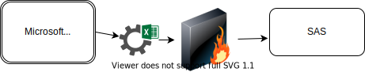
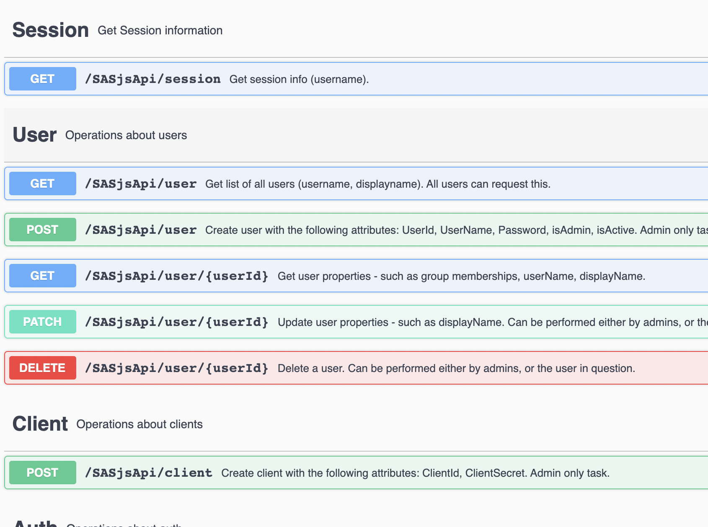
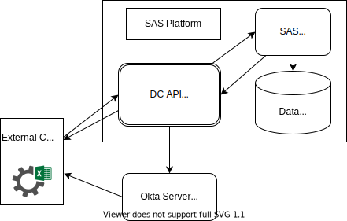

<!--
npx @marp-team/marp-cli api.md -o index.html
-->

# Automated Spreadsheet Ingestion

---
<!-- header:  -->

# About Us

- SAS Apps - sasapps.io
- SASjs - sasjs.io
- Data Controller - datacontroller.io
- SAS Quiz game - sasensei.com

---
# Customer Situation

---

# Challenges

- Automation (w/o browser)
- Authentication / Authorisation (Okta)
- Data Management / Data Quality
- Easy to Use & Maintain

---

# Data Controller for SAS&reg;

- All versions of Excel
- Every SAS platform
- Zero-Code
- Built-in DQ and Audit

---
# Data Controller for SAS&reg;

Demo: [Excel to SAS](https://www.youtube.com/watch?v=kMITwFPrTTM)

---

# SASjs Server

 - REST API for Foundation SAS
 - Open Source: https://github.com/sasjs/server
 - Extendable
   - [Okta](https://www.okta.com) Authentication
   - [Data Controller](https://datacontroller) Integration

---

# SASjs Server

---

# Proposal

---

# questions? <!-- fit -->

